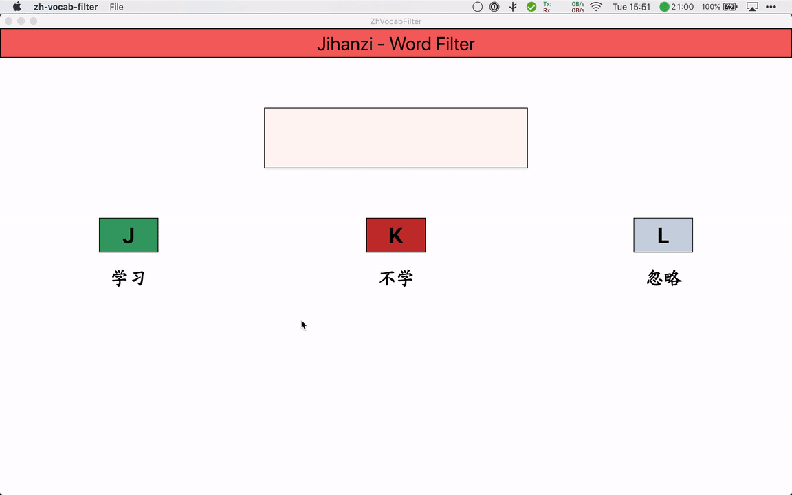

# ZH-Vocab-Filter
A desktop app for quickly filtering word lists, categorizing words as:

- to study
- not to study
- always ignore

Words to study and words to ignore can be saved in two different files 
in the same directory as the original word list file.

## Usage example

